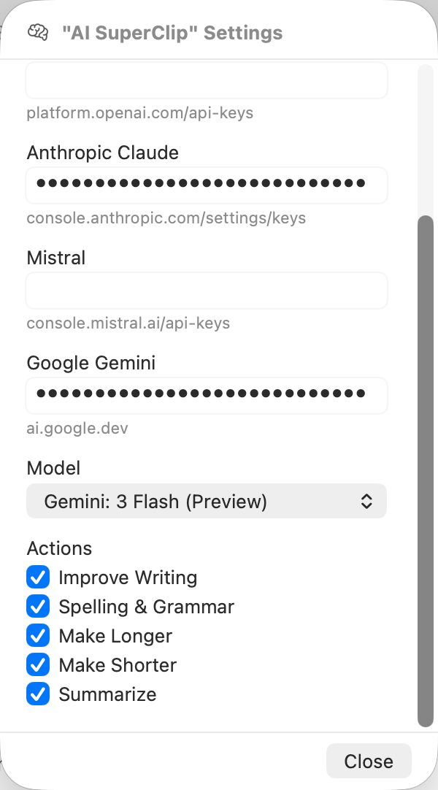

# AI SuperClip

A powerful PopClip extension that enhances your selected text using multiple AI providers.

**Created by Steve Reinhardt | SR Works LLC**

## Supported AI Providers

| Provider | Models |
|----------|--------|
| **OpenAI** | GPT-4.1, GPT-4.1 mini, GPT-4o, GPT-4o mini |
| **Anthropic Claude** | Opus 4.5, Sonnet 4.5, Sonnet 4, Haiku 4.5, Sonnet 3.5, Haiku 3.5 |
| **Mistral AI** | Large 3, Medium 3, Small 3.2 |
| **Google Gemini** | 2.5 Pro, 2.5 Flash, 2.0 Flash |

## Features

- **Improve Writing**: Enhance clarity, flow, and impact
- **Correct Spelling & Grammar**: Fix errors while maintaining style
- **Make Longer**: Expand text with additional detail
- **Make Shorter**: Condense to essential points
- **Summarize**: Extract key points and conclusions

### Additional Features

- Hold **SHIFT** to copy the response to clipboard instead of pasting
- Toggle individual actions on/off in settings
- Consistent warm, professional tone across all outputs
- Plain text output (no markdown formatting)

## Installation

### Option 1: Download Release

1. Download `AI_SuperClip.popclipextz` from the releases page
2. Double click the file
3. Follow PopClip instructions

### Option 2: Clone Repository

1. Clone the repo: `git clone <repo-url>`
2. Double click on the `AI_SuperClip.popclipext` folder
3. Follow PopClip instructions

## Configuration

You need API keys from the providers you want to use. Get them here:

- **OpenAI**: https://platform.openai.com/account/api-keys
- **Anthropic Claude**: https://console.anthropic.com/settings/keys
- **Mistral AI**: https://console.mistral.ai/api-keys
- **Google Gemini**: https://ai.google.dev

## Debug

1. Run: `defaults write com.pilotmoon.popclip EnableExtensionDebug -bool YES`
2. Open **Console.app** and filter by: `Process:PopClip Category:Extension`

## License

MIT License

Copyright (c) 2025 Steve Reinhardt, SR Works LLC

Permission is hereby granted, free of charge, to any person obtaining a copy
of this software and associated documentation files (the "Software"), to deal
in the Software without restriction, including without limitation the rights
to use, copy, modify, merge, publish, distribute, sublicense, and/or sell
copies of the Software, and to permit persons to whom the Software is
furnished to do so, subject to the following conditions:

The above copyright notice and this permission notice shall be included in all
copies or substantial portions of the Software.

THE SOFTWARE IS PROVIDED "AS IS", WITHOUT WARRANTY OF ANY KIND, EXPRESS OR
IMPLIED, INCLUDING BUT NOT LIMITED TO THE WARRANTIES OF MERCHANTABILITY,
FITNESS FOR A PARTICULAR PURPOSE AND NONINFRINGEMENT. IN NO EVENT SHALL THE
AUTHORS OR COPYRIGHT HOLDERS BE LIABLE FOR ANY CLAIM, DAMAGES OR OTHER
LIABILITY, WHETHER IN AN ACTION OF CONTRACT, TORT OR OTHERWISE, ARISING FROM,
OUT OF OR IN CONNECTION WITH THE SOFTWARE OR THE USE OR OTHER DEALINGS IN THE
SOFTWARE.
